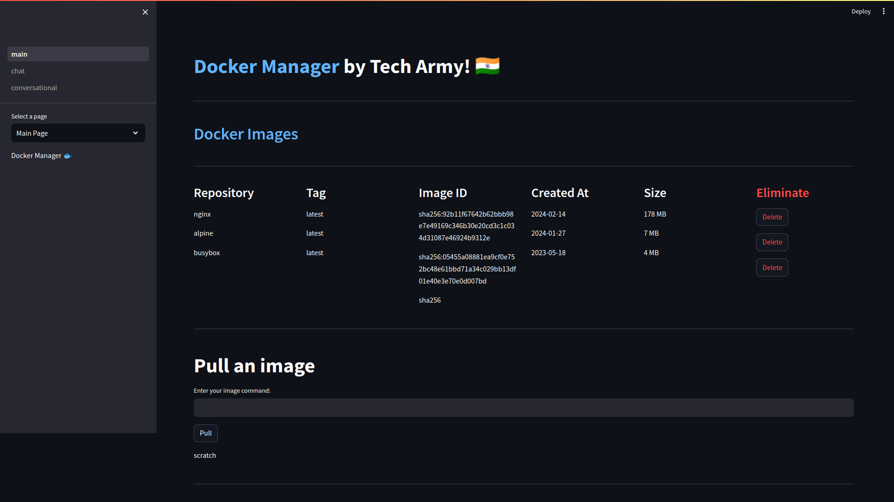
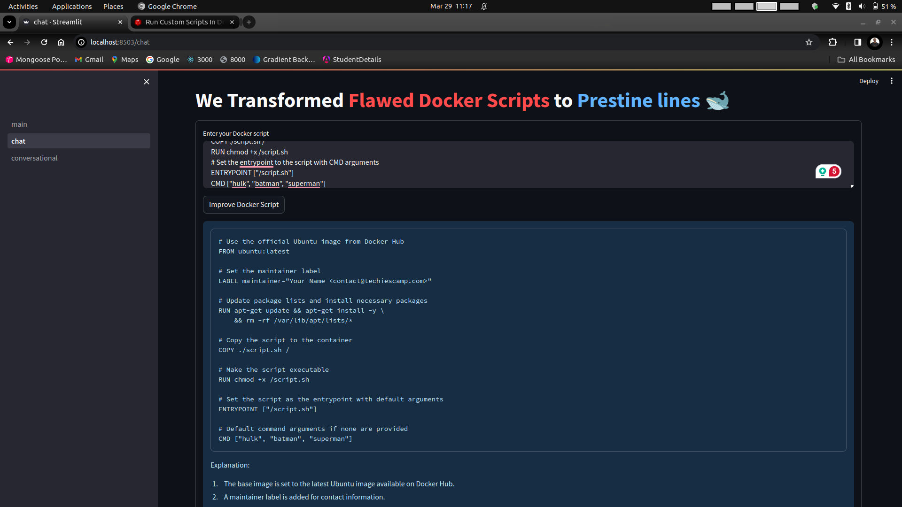
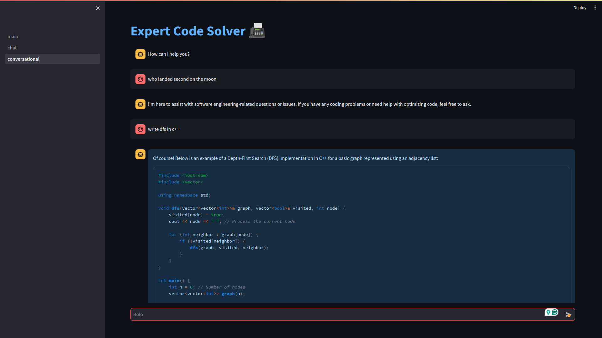

<h1> A Docker Dashboard built in the HackVerse Hackathon </h1>
<h2> Team Name: Tech Army </h2>

<h2> Features </h2>
<ul>
  <li> Docker Dashboard </li>
  <li> Docker Image Manager </li>
  <li> Docker Container Management </li>
  <li> Docker Chatbot (Exclusively Response only to docker related questions)</li>
  <li> Bonus :  A Software Engineering bot that responses only to software related queries (Both leverage OpenAI's API) </li>
</ul>

    <h2> Tech Stack : </h2>
    <ul style="list-style-type: none; display:flex;justify-content: space-evenly;align-items:center;">
        <li style=""> </img></li>
        <li> </li>
        <li style="font-size: 32px;"> 🦜️🔗 </li>
        <li> </li>   
         <li> </li>   
    </ul>

    <h2> Snapshots </h2>
    
    
    

    <h2> How to run </h2>
    <ul style="list-style-type: none;">
        <li> Clone the repository </li>
        <li> Create a virtual environment </li>
        <li> Run the following command to install the dependencies </li>
        <code> pip install -r requirements.txt </code>
        <li> Load your environment variables [2 OpenAI api Keys; one for each bot] </li>
        <li> Run the following command to start the server </li>
        <code> streamlit run main.py </code>
    </ul>

    <h2> Contributors </h2>
    <ul style="list-style-type: none;">
        <li> <a href=""> Disha (Team Lead) </a> </li>
        <li> <a href=""> Swetank  </a> </li>
        <li> <a href=""> Harsh  </a></li>
        <li> <a href=""> Kelmith </a></li>

